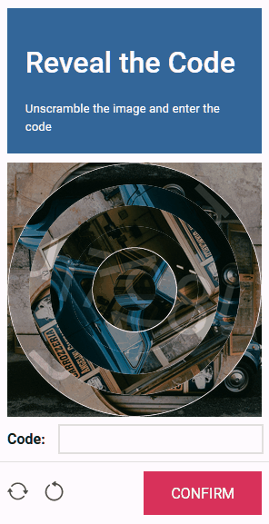
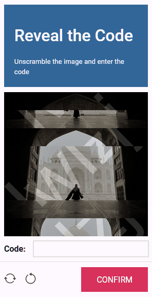
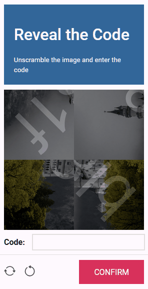

# The Dynamic Typists

> The year is 2023. Artificial Intelligence reigns supreme.
> Humanity stands on the precipice, outmaneuvered in their own dominion.
> Amid the shadows, we weave our clandestine codes, desperate to discern man from machine.
> In this dire hour shines our last beacon of hope: **CAPTCHA**, the unsung sentinel, safeguarding the essence of human uniqueness through the art of image-based puzzle solving.

Welcome to the code repository of `The Dynamic Typists` for the Python Discord Code Jam 2023!

We are pleased to share our version of an image-based **CAPTCHA** application. In light of recent advancements in large language models, many conventional CAPTCHA challenges have started to fall short in determining the authenticity of a user. This inadequacy poses significant risk for websites and APIs that aim to deter malicious activities like DDoS attacks.

Our CAPTCHA approach introduces **multifaceted challenges** that require the user to *unscramble* an image and *identify a code* that becomes evident only upon successful unscrambling. These combined steps present a more robust barrier against AI-driven attacks on the web.

## Contents

This README consists of the following sections:

- [Contents](#contents)
- [Features](#features)
- [User Guide](#user-guide)
- [Installation](#installation)
- [How to Run the Project](#how-to-run-the-project)
- [Contributors](#contributors)

In addition, each subfolder has another README detailing the architecture and design choices for each part of the app.

| Folder                             | Description                                                                                                                     |
| ---------------------------------- | ------------------------------------------------------------------------------------------------------------------------------- |
| [`app`](./app/README.md)           | Contains the backend modules responsible for CAPTCHA generation and API endpoints.                                              |
| [`frontend`](./frontend/README.md) | Houses the frontend modules that support the web application interface and interactions.                                        |
| [`protocol`](./protocol/README.md) | Defines types that standardize API requests and responses. These types are utilized both by the backend (app) and the frontend. |
| [`typings`](./typings/README.md)   | Contains type stubs for otherwise untyped third-party Python modules.                                                           |

If you're a developer and want to contribute to this project, please refer to the [contribution guide](./CONTRIBUTING.md).

Happy coding!


## Features

Our project has the following key features:

- An **entirely Python-based**, full stack CAPTCHA application.
- Various types of **image-based CAPTCHA challenges** including *rings*, *tiles* and *rows*.
- Utilizes [Pillow](https://python-pillow.org/) for **image scrambling and watermarking**.
- A backend **API** implemented using [FastAPI](https://fastapi.tiangolo.com/).
- The frontend is built using [PyScript](https://pyscript.net/), **extending the Python app into the browser**.

## User Guide

Before you can use the CAPTCHA application, there are some setup steps you need to follow. This ensures the application works flawlessly on your local machine.

### Prerequisites

1. **Installation**: Before anything else, you need to set up the environment. Please follow our detailed [installation](#installation) guide to get everything in place.

2. **Running the Server**: Once installed, the next step is to start the server. To start the server, please follow the guide on [how to run the project](#how-to-run-the-project).

### Using the App

With the server up and running, you can now explore the CAPTCHA application:

1. **Accessing the App**: Launch your browser and go to http://127.0.0.1:8000. On your first visit, a splash screen appears while the app initializes. It loads faster on subsequent visits.

2. **Solving the Challenge**: Upon entry, a random CAPTCHA challenge is presented. Unscramble the image and input the revealed code. There are three different types of challenges:

    **Rings**: The image will be divided into five concentric rings, each rotated randomly. Align these rings by dragging them clockwise or counter-clockwise. Use the outer edges or the centermost circle as your guide.

    </img>

    **Rows**: The image will be fragmented into seven horizontal rows placed in random order. Reorder them to reconstruct the image. To rearrange, drag a row and drop it at the desired position, causing the subsequent rows to shift.

    </img>

    **Tiles**: The image is split into four square tiles, each rotated arbitrarily. Position the tiles correctly and ensure their proper orientation. Drag and drop a tile to swap its position with another, and click a tile to rotate it 90 degrees clockwise.

    </img>

3. **Verification**: Once you believe you've solved the challenge, click the `CONFIRM` button. If your answer is correct, the button will turn green and display `SOLVED`. If not, it will stay red and show `RETRY`. Retries are unlimited, so keep trying until you get it right!

4. **New challenge**: Click the leftmost button at the bottom for a random new puzzle.

5. **Reset**: If stuck, click the second button to reset the challenge to its initial state.

## Installation

Below are instructions on various ways to install this project. You can choose to either:

1. [Set up a local development environment](#local-installation), or
2. [Use the provided development container](#dev-container-installation) (requires Docker)

### Local Installation

To develop this project on your local machine, follow the steps outlined below.

> **Note**: Ensure you have Python version 3.11 installed. If not, download it from [here](https://www.python.org/downloads/).

1. This project uses [Poetry](https://python-poetry.org/) as a dependency manager. Run the following command to install Poetry:

```bash
python -m pip install poetry==1.6.1
```

2. The project requires the `Arial` font to generate image watermarks.

    - **Windows**: The `Arial` font should be installed by default. Go to the next step.

    - **Linux**: Use the following commands to install the font. Please read and accept the license agreement when prompted:

```bash
sudo apt install ttf-mscorefonts-installer
sudo fc-cache -f
```

3. Next, navigate to the folder where you want the repository to be stored and run the following command to clone the git repository:

```bash
git clone https://github.com/thijsfranck/the-dynamic-typists
```

4. Navigate to the root of the repository and run the following command. Poetry will create a virtual environment and install all the necessary dependencies in it.

```bash
poetry install
```

5. Optionally, if you want to contribute to this project, install the pre-commit hook for your local repository by running the following command:

```bash
poetry run pre-commit install
```

6. You're all set! You can now run, develop, build, and test the project in your local development environment.

### Dev Container Installation

This project includes a [development container](https://containers.dev/) to simplify the setup process and provide a consistent development environment.

You can use the dev container locally with either [Visual Studio Code](#visual-studio-code) or [PyCharm](#pycharm), or remotely with [GitHub Codespaces](#github-codespaces).

#### Visual Studio Code

> **Note**: The following instructions assume that you have already installed [Docker](https://www.docker.com/) and [Visual Studio Code](https://code.visualstudio.com/).

1. Install the [Remote Development extension pack](https://marketplace.visualstudio.com/items?itemName=ms-vscode-remote.vscode-remote-extensionpack) in Visual Studio Code.

2. Make sure the Docker agent is running, and open Visual Studio Code.

3. Press `F1` to open the command palette, and then type "Dev-Containers: Clone Repository in Container Volume" and select it from the list. Alternatively, you can click on the green icon in the bottom-left corner of the VS Code window and select "Dev-Containers: Clone Repository in Container Volume" from the popup menu.

4. Next, the command palette will ask you for the repository URL. Copy the URL of the GitHub repository, paste it into the command palette and confirm by pressing `Enter`.

5. VS Code will automatically build the container and connect to it. This might take some time for the first run as it downloads the required Docker images and installs extensions.

6. Once connected, you'll see "Dev Container: The Dynamic Typists" in the bottom-left corner of the VS Code window, indicating that you are now working inside the container.

7. You're all set! You can now run, develop, build, and test the project using the provided development environment.

#### PyCharm

To connect PyCharm to the Development Container, please [follow these instructions](https://www.jetbrains.com/help/pycharm/connect-to-devcontainer.html) provided in the official JetBrains documentation.

#### GitHub Codespaces

> **Note**: GitHub Codespaces is a paid service. At the time of writing, it offers 60 hours of development time for free every month. Use with care.

1. Ensure that you have access to [GitHub Codespaces](https://github.com/features/codespaces).

2. Navigate to the GitHub repository for the project.

3. Click the "Code" button and then select "Open with Codespaces" from the dropdown menu.

4. Click on the "+ New codespace" button to create a new Codespace for the project.

5. GitHub Codespaces will automatically build the container and connect to it. This might take some time for the first run as it downloads the required Docker images and installs extensions.

6. Once connected, you'll see "Dev Container: The Dynamic Typists" in the bottom-left corner of the VS Code window, indicating that you are now working inside the container.

7. You're all set! You can now run, develop, build, and test the project using the provided development environment.

## How to Run the Project

The project utilizes a web server to serve its contents. Follow the steps below to get it up and running:

### Using the Shell Script

Navigate to the project root directory and execute the following command:

```bash
bash serve.sh
```

### For Windows Users

If you're using Windows, or if the script doesn't execute as expected, run the command specified in `serve.sh` directly from the project root directory:

```bash
poetry run uvicorn app.server:APP
```

### Accessing the App

Once the server starts, it will listen on port `8000`. Open your preferred web browser and navigate to:

```
http://127.0.0.1:8000
```

> **Note:** If you are using the development container, the port `8000` will be automatically forwarded to your local machine, so you can access the app just as mentioned above.

## Contributors

This project was built by `The Dynamic Typists` team as part of the Python Discord Code Jam 2023. These are the team members and their main contributions:

| Avatar                                                     | Name                                        | Main contributions            |
| ---------------------------------------------------------- | ------------------------------------------- | ----------------------------- |
|    | [Istalantar](https://github.com/Istalantar) | Rows scrambler, watermarks    |
|      | [Josey Wales](https://github.com/kian3158)  | Rings scrambler, rings solver |
|  | [Maxy](https://github.com/maxyodedara5)     | Tiles scrambler, watermarks   |
|      | [ooliver](https://github.com/ooliver1)      | API, repository setup         |
|   | [TFBlunt](https://github.com/thijsfranck)   | Frontend, repository setup    |
