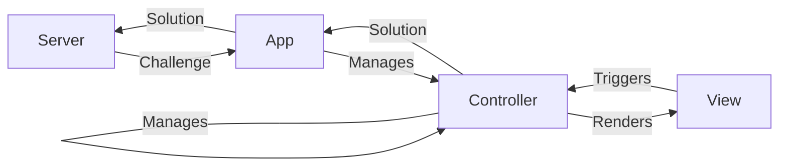

# Frontend

The frontend of our CAPTCHA application serves as the user's primary interface to interact with our challenges. It's designed to be intuitive, responsive, and robust.

This README dives into the technical aspects of our frontend design, shedding light on our architectural decisions and library choices.

## Architecture

The CAPTCHA application's frontend is designed for both simplicity and modularity, drawing inspiration from the Model-View-Controller (MVC) pattern.

**View**: Represents the main UI with various static elements as well as a dedicated slot for rendering different kinds of CAPTCHA challenges.

**Controllers**: Controllers manage the rendering for each CAPTCHA type. Some encompass subcontrollers for tasks like image scaling or rotation. They use an event-driven approach, responding to UI interactions, and may keep internal state as necessary.

**App**: A central entity that manages controllers and facilitates communication with the backend server.

**Server**: Responsible for generating new challenges upon request from the app, and checking the solutions posted by the user. The app is identified by the server using a session token.

**Initialization**: The application is bootstrapped via `main.py`, linking static UI elements from `index.html` to the underlying logic.

## Library and Framework Choices

Our CAPTCHA application is built upon [PyScript](https://pyscript.net/). Given the Python-centric nature of the Code Jam, PyScript presented itself as a novel and fitting solution, aligning with both the spirit of the event and our technical requirements.

### PyScript

The PyScript library provides HTML tags for embedding and executing Python code in your browser. It uses Pyodide under the hood, which is explained in the next section.

### Pyodide

At its core, [Pyodide](https://pyodide.org/en/stable/) is a Python interpreter compiled to [WebAssembly](https://webassembly.org/). This allows Python to run directly in the browser. Pyodide achieves this by leveraging the CPython interpreter and the [Emscripten](https://emscripten.org/) toolchain to generate WebAssembly binaries.

Key features include:

**Standard Library and Packages**: Pyodide includes the full Python standard library and even supports importing some popular Python packages.

**JavaScript Integration**: One of Pyodide's strong suits is its ability to seamlessly interact with JavaScript. It can call JavaScript functions directly from Python and vice versa.

**Isolation and Security**: Pyodide runs within the browser's sandboxed environment, making it isolated and secure. This ensures that the executed Python code cannot cause harm to the host system.

### Benefits

**Python in the Browser**: The capability of running Python code natively in the browser is a unique trait that distinguishes our project from those of other teams. Having the codebase fully in Python, rather than partly in JavaScript, is in the spirit of the Code Jam and allows for more of our code to be submitted for judging.

**Browser API Support**: Pyodide offers direct interaction with browser APIs, mirroring the experience of JavaScript development. This similarity allowed us to swiftly translate our initial JavaScript prototype into Python, accelerating the development process considerably.

**Type Reusability**: Since the complete stack is written in Python, type definitions can easily be shared between the backend and frontend. This improved cohesion is invaluable when the API and frontend are developed by different team members, as in our case. Any breaking change to the protocol is automatically flagged by the static type checker, which ensures that interfaces remain consistent.

### Drawbacks

**User Experience Impact**: Pyodide's initialization introduces longer loading times at startup. Despite PyScript's splash screen, the delay remains noticeable compared to the near-instant load times of plain JavaScript. We decided to accept this as a tradeoff for having our codebase completely in Python.

**Type Checking Limitations**:  The type stubs provided with Pyodide don't cover all the Web APIs we use. This means we could not achieve comprehensive static type checking, increasing the risk for potential bugs that could have been caught otherwise. To mitigate this risk, we extended the provided type stubs, to the extent we require, based on [the Mozilla Web API documentation](https://developer.mozilla.org/en-US/docs/Web/API). The extended type stubs are located in the [typings](../typings/) folder at the root of the project.
